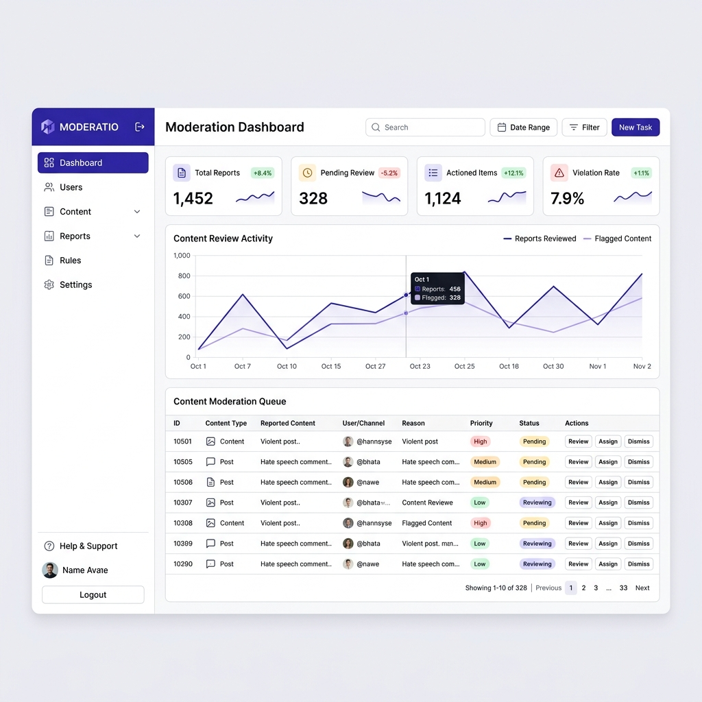
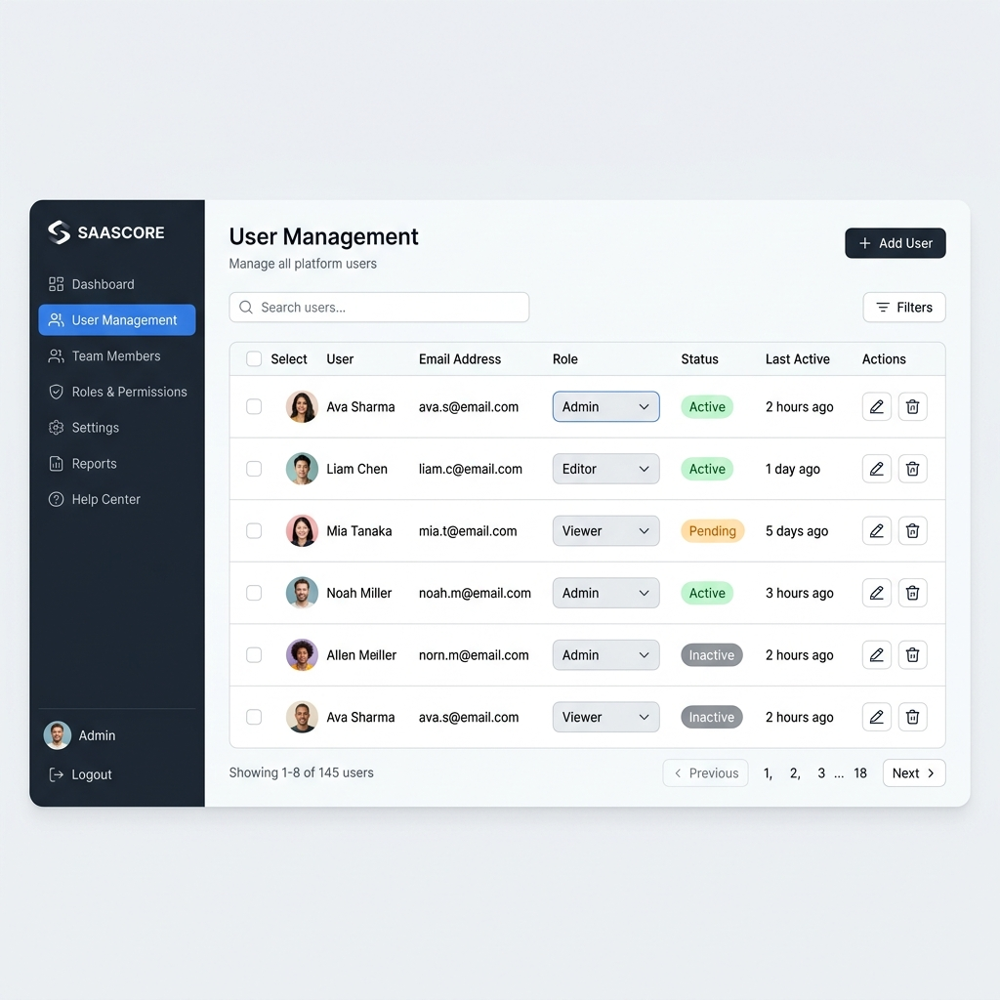
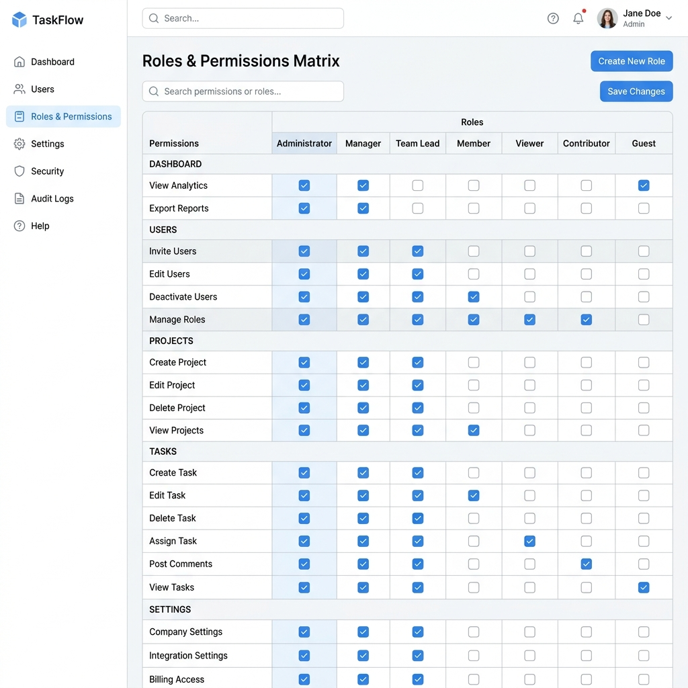
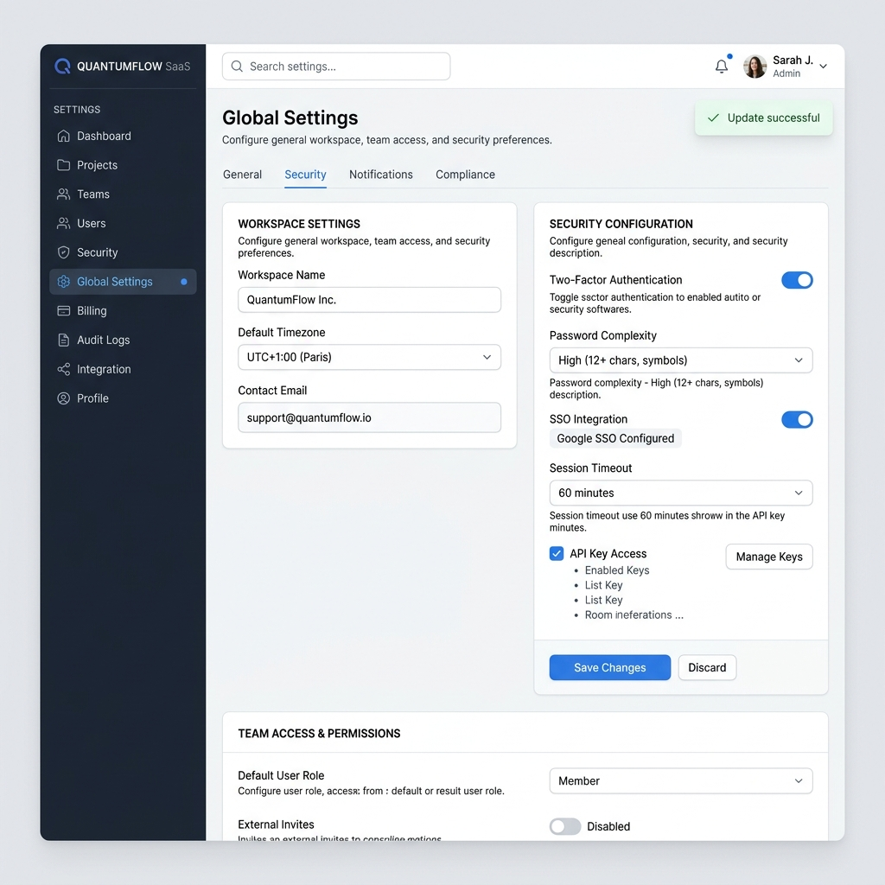

# Nearby Locator - Administrative Platform Documentation

This document covers the complete structure, permissions, and usage of the Nearby Locator Administrative Platform.

## 1. Access & Credentials

### Admin URL(s)
- **Local Development:** `http://localhost:3000/admin`
- **Operations Center:** `http://localhost:3000/admin/operations`
- **Admin Settings:** `http://localhost:3000/admin/settings`

### Default Development Credentials
By default, the platform requires an active Super Admin for initial bootstrapping. 
- **Email:** `superadmin@nearby-dev.local`
- **Password:** `SuperAdmin123!Dev`
- **Role:** Super Admin

### How to Seed the Super Admin
To generate or reset the development Super Admin account, execute the following script from the `backend` directory:
```bash
npm run seed:admin
```
*Note: This script is idempotent and completely blocked in production environments (`NODE_ENV === 'production'`).*

---

## 2. Platform Architecture

### Admin Navigation Map
The administrative sidebar dynamically renders based on the user's `permissions` array:

1. **Moderation Queue** (`/admin`) - Unrestricted for all admins
2. **User Management** (`/admin/users`) - Requires `users.read`
3. **Roles & Permissions** (`/admin/roles`) - Requires `roles.read`
4. **Operations Center** (`/admin/operations`) - Requires `audit.read`
5. **System Diagnostics** (`/admin/system`) - Requires `metrics.read`
6. **API Documentation** (`/admin/api`) - Unrestricted
7. **Data Exports** (`/admin/exports`) - Requires `audit.export`
8. **Platform Settings** (`/admin/settings`) - Requires `settings.read`
9. **Admin Profile** (`/admin/profile`) - Inherits global layout access

### Permission Matrix
The system uses strict granular node-based permissions rather than legacy monolithic roles. 

| Permission Node       | Purpose & Impact                                           |
|-----------------------|------------------------------------------------------------|
| `users.read`          | View user accounts, profiles, and basic status metrics     |
| `users.create`        | Provision new accounts manually                            |
| `users.update`        | Suspend accounts, force logouts, reset passwords           |
| `roles.read`          | View the hierarchy and the permissions matrix              |
| `roles.update`        | Modify assigned role permissions (Triggers Sudo Step-Up)   |
| `audit.read`          | Read global audit logs, auth events, and moderation trails |
| `audit.export`        | Export platform PII data to CSV (Triggers Sudo Step-Up)    |
| `metrics.read`        | View control-plane metrics and Postgres runtime stats      |
| `settings.update`     | Alter global platform configurations                       |

---

## 3. Available Admin APIs

The control plane exposes the following protected backend endpoints mounted at `/api/admin`:

| Method | Endpoint                        | Required Permission | Sudo Required? |
|--------|---------------------------------|---------------------|----------------|
| GET    | `/users`                        | `users.read`        | No             |
| POST   | `/users/:id/suspend`            | `users.update`      | No             |
| GET    | `/roles`                        | `roles.read`        | No             |
| PUT    | `/roles/:roleId/permissions`    | `roles.update`      | **Yes**        |
| GET    | `/audit-logs`                   | `audit.read`        | No             |
| GET    | `/sessions`                     | `users.read`        | No             |
| DELETE | `/sessions/:id`                 | `users.update`      | No             |
| POST   | `/export-data`                  | `audit.export`      | **Yes**        |
| GET    | `/settings`                     | `settings.read`     | No             |
| PUT    | `/settings`                     | `settings.update`   | **Yes**        |
| GET    | `/system/info`                  | `metrics.read`      | No             |

---

## 4. Platform Previews

Below are visual layouts of the primary administrative interfaces:

### Dashboard & Analytics


### User Management & Identity


### Roles & Permissions Matrix


### Platform Settings & Security


---

## 5. Troubleshooting Guide

**1. Cannot log in with Super Admin credentials?**
- Verify the backend server is running (`npm start` or `npm run dev` in the backend directory).
- Ensure the seed script executed successfully without throwing a PostgreSQL connection error.
- Double-check that you are using `SuperAdmin123!Dev` (case-sensitive).

**2. Sidebar links are missing?**
- The navigation bar is dynamically driven by your permissions. If you modified the Super Admin role and removed `audit.read` or `users.read`, the links will vanish. You will need to re-run `npm run seed:admin` to repair your baseline privileges.

**3. "Step-up Verification Failed" during Sudo actions?**
- The Sudo module requires your *current* account password. It intercepts the request and prevents cookie-hijacking by forcing a re-validation of your active token. 

**4. Postgres Geometry / PostGIS warnings during seed?**
- If you see `PostGIS extension NOT available`, this is normal. The backend automatically detects the absence of PostGIS and degrades gracefully to native PostgreSQL geometric types (`point`).

**5. Environment Variables for Admin Modules**
- Ensure `JWT_SECRET` is heavily randomized in `.env`.
- For Data Exports to generate securely, ensure `NODE_ENV` is appropriately set so strict transport security headers are applied.
