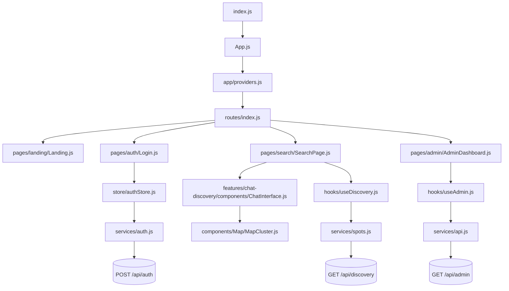
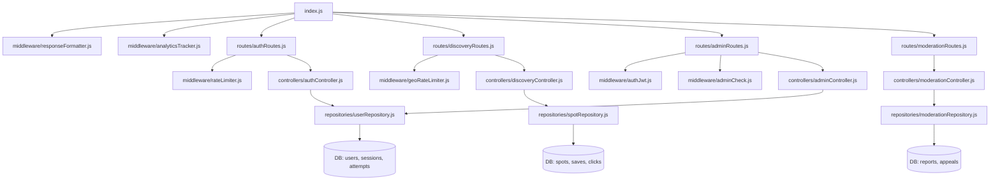
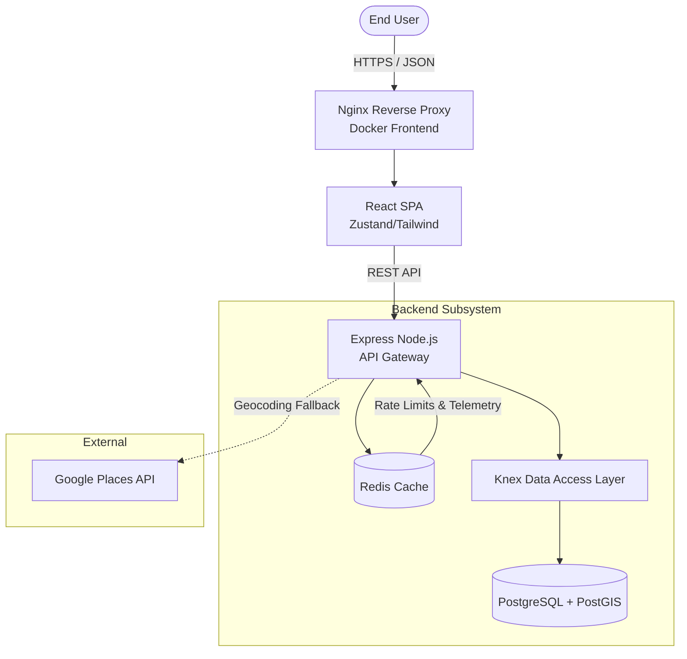
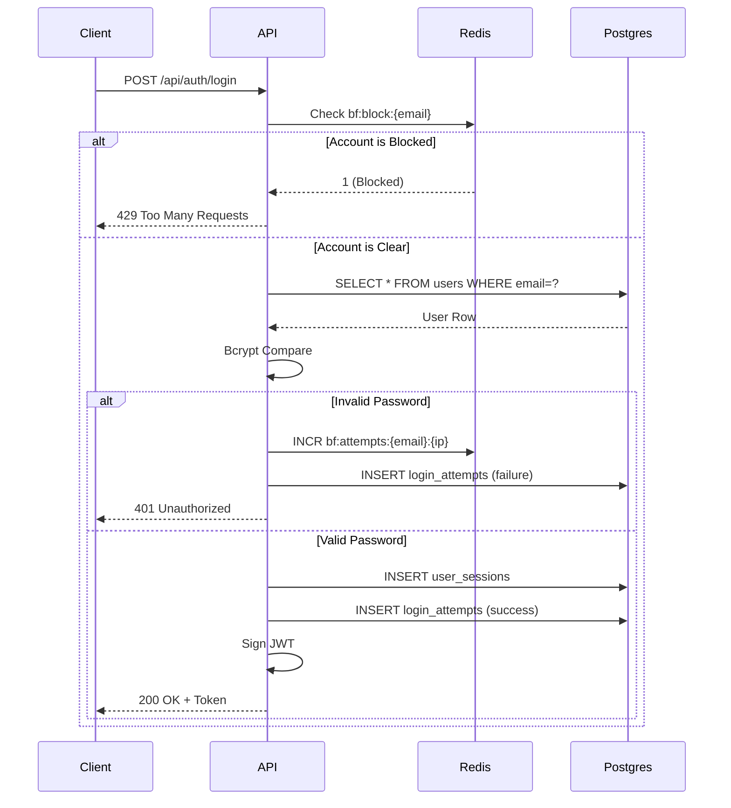
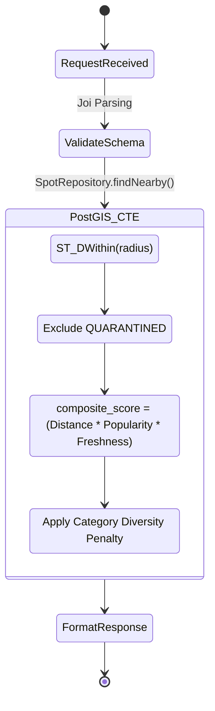
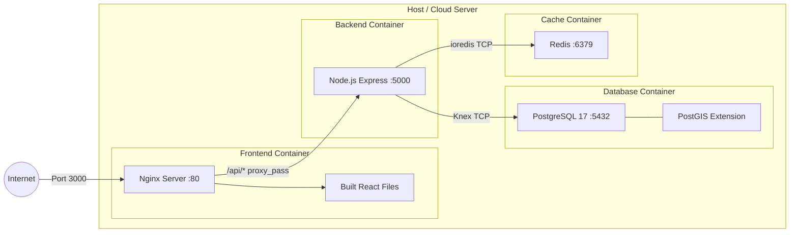

# Deep Architecture Analysis & Lineage

## 1. Frontend Dependency Graph

---

## 2. Backend Dependency Graph

---

## 3. Database Lineage (Read/Write Map)

This table maps out which backend controllers Read (R) or Write (W) to specific PostgreSQL tables.

| Table | Readers (R) | Writers (W) | Primary Purpose |
| :--- | :--- | :--- | :--- |
| `users` | AuthCtrl, UserCtrl, AdminCtrl | AuthCtrl, AdminCtrl | Core identity and profile data. |
| `login_attempts` | AuthCtrl (Brute-force check) | AuthCtrl | Security auditing and lockouts. |
| `user_sessions` | `authJwt` middleware | AuthCtrl | Stateful session token persistence. |
| `spots` | SpotCtrl, DiscoveryCtrl, AdminCtrl | SpotCtrl, AdminCtrl | Geospatial POI data (PostGIS coordinates). |
| `discovery_searches` | AdminCtrl (telemetry) | DiscoveryCtrl | Search analytics and trending data. |
| `discovery_clicks` | SpotRepo (ranking calculation) | DiscoveryCtrl | Engagement tracking for Spot score. |
| `discovery_saves` | SpotRepo (ranking calculation) | DiscoveryCtrl | High-intent engagement tracking. |
| `reports` | ModCtrl, AdminCtrl | ModCtrl | User-submitted flags for moderation. |
| `moderation_appeals` | AdminCtrl | ModCtrl | Disputes against moderation action. |
| `audit_logs` | AdminCtrl | AdminCtrl, ModCtrl | Immutable history of sensitive Admin actions. |
| `system_errors` | AdminCtrl | `errorHandler` middleware | Fatal unhandled exception logging. |

---

## 4. Request Lifecycle: Major Features

### A. Nearby Discovery Search
1. **Trigger**: User pans map or types query in Chat UI.
2. **Client**: `services/spots.js` sends `GET /api/discovery/search?lat=X&lng=Y&radius=Z&category=A`.
3. **Gateway**: `geoRateLimiter` permits request. `lenientAuthJwt` attaches User ID if logged in (for personalization) but allows guest access.
4. **Controller**: `discoveryController.js` validates bounds via Joi.
5. **Database Layer**: `SpotRepository.findNearby` constructs a **PostGIS CTE (Common Table Expression)**. It calculates a `composite_score` incorporating `ST_Distance()`, `freshness_score`, and joins against `discovery_clicks` for a `popularity_score`.
6. **Result**: An MMR (Maximal Marginal Relevance) diversified array of Spots is returned to the client.

### B. Authentication Lifecycle (Login)
1. **Trigger**: User submits login form.
2. **Client**: `authStore.js` dispatches `POST /api/auth/login`.
3. **Gateway**: `ipRateLimiter` restricts IP to 60 attempts/hour. `checkAccountLockout` reads Redis `bf:block:*` keys to block brute-forcers.
4. **Controller**: `authController.js` fetches user from `users` table. Checks bcrypt hash.
5. **Database Layer**: Writes to `login_attempts` (is_successful=true). Writes new row to `user_sessions`.
6. **Result**: Generates JWT token. Returns token & user object. React updates `AuthStore` and redirects to `/search`.

### C. Trust & Safety (Moderation Flagging)
1. **Trigger**: User flags a location as "Closed/Spam".
2. **Gateway**: `authJwt` requires active bearer token.
3. **Controller**: `moderationController.js` validates payload.
4. **Database Layer**: Writes a row to `reports` table linked to the `spot_id`.
5. **Admin Flow**: Admin dashboard queries `GET /api/moderation/admin/queue`.
6. **Admin Action**: Admin calls `POST /api/moderation/admin/spots/:id/action`. `adminController.js` updates `spots.moderation_status` to `'QUARANTINED'`. The `SpotRepository` search CTE automatically excludes `QUARANTINED` spots dynamically.

---

## 5. Architectural Mermaid Diagrams

### 5.1 System Architecture

### 5.2 Authentication & Brute-Force Flow

### 5.3 Advanced Spatial Search Flow

### 5.4 Docker Deployment Topology

