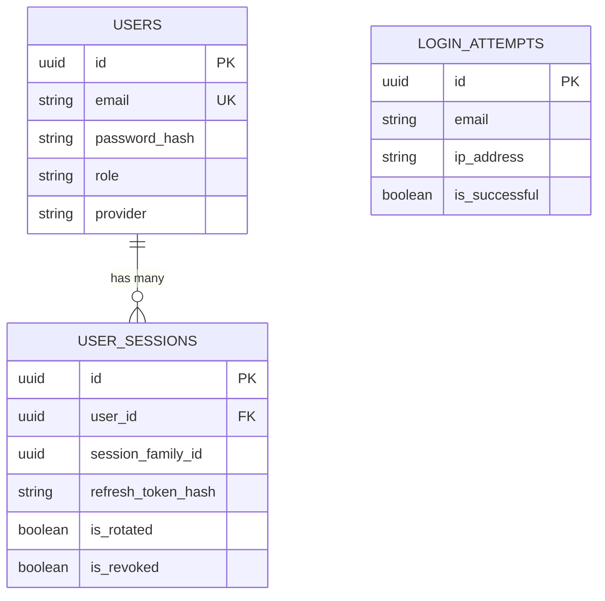

# Authentication & Authorization Module Audit
**Date:** 2026-07-06  
**Scope:** Production Code Audit  

---

## 1. Authentication Flow

### Mechanisms & Implementations
- **Registration Flow:** Users submit `email`, `password`, `name`. Handled by `authController.js:signup`. A local user is created inside a transaction (`UserRepository.createLocalUser`). An initial session family is generated, returning a JWT and securely setting a `refreshToken` cookie.
- **Login Flow:** User submits credentials. `authController.js:login` validates the bcrypt hash. A `session_family_id` is established for lineage tracking, written to `user_sessions`. JWT is returned, and `refreshToken` is set as an `HttpOnly` cookie.
- **Logout Flow:** `authController.js:logout` revokes the specific `sessionId` in the database and flushes the Redis cache. `logoutAll` revokes all active sessions for the user.
- **Refresh Token Flow:** `authController.js:refresh` receives the `HttpOnly` cookie. It enforces **Refresh Token Rotation (RTR)**. The old session is marked `is_rotated`. A new session is inserted under the same `session_family_id`. **Replay Attack Detection** is implemented: if a rotated/revoked token is used, the *entire* session family is revoked.
- **Session Handling:** Hybrid. Redis is used as a fast "active session" cache (`session:active:{id}`). PostgreSQL `user_sessions` is the source of truth.
- **Password Hashing:** `bcrypt` with a cost factor of 12 (`authController.js:67`).
- **JWT Generation:** Minimal claims (`sub`, `sid`). Explicitly lacks PII. Expires in 15 minutes (`authController.js:15`).
- **Middleware:** `authJwt.js` decodes the JWT, verifies the `sessionId` against Redis, and falls back to PostgreSQL on cache miss. Sets `req.user`.
- **Google OAuth:** Partially implemented via `authController.js:googleUpsert`. Maps a Google ID to an email and issues standard application JWTs.
- **Password Reset:** Implemented (`authController.js:requestPasswordReset`). Generates a token hashed with `sha256`, enforces a 60-second request throttle, and invalidates all active sessions upon successful reset.
- **Email Verification:** Database columns exist (`email_verification_token_hash` per `20260518_harden_auth_and_sessions.js`), but no implementation logic exists in `authController.js`.

---

## 2. Authorization

### Roles & Permissions System
The system utilizes a **Mixed** authorization model, currently experiencing technical debt due to overlapping paradigms:

1. **RBAC with Permissions (`rbac.js`):**
   - **Roles:** `user`, `support_agent`, `support_lead`, `compliance`, `super_admin`.
   - **Hierarchy:** Weighted from 0 to 4 (`ROLE_WEIGHTS`).
   - **Permissions:** Granular strings (e.g., `MODERATE_USER`, `IMPERSONATE_USER`).
   - **Implementation:** `checkPermission(PERMISSIONS.X)` validates against `ROLE_PERMISSIONS` mappings.

2. **Hardcoded Legacy Checks (`adminCheck.js`):**
   - **Condition:** `user.role === 'admin' || user.email === 'admin@locator.com'`.
   - **Conflict:** The role `'admin'` is NOT defined in `rbac.js:ROLES`. This represents a split brain in the authorization logic.

3. **Break-Glass Override (`authJwt.js`):**
   - An emergency `x-break-glass-secret` header automatically elevates the user to `super_admin` with `isSudo=true`, bypassing all standard authentication.

---

## 3. Database Analysis

### `users`
- **Purpose:** Core identity table.
- **Columns:** `id`, `email`, `password_hash`, `name`, `role`, `provider`, `google_id`, `status`, reset/verification tokens.
- **Indexes:** `email` (UNIQUE), `google_id` (UNIQUE), `idx_users_role`.
- **Lineage:** Written by `authController.js`, `adminController.js`, `UserRepository.js`. Read by nearly all middleware.
- **Assessment:** Sufficient for production. Normalized correctly.

### `user_sessions`
- **Purpose:** Tracks active, rotated, and revoked JWT refresh sessions.
- **Columns:** `id`, `user_id` (FK), `session_family_id`, `refresh_token_hash`, `is_rotated`, `is_revoked`, `ip_address`, `expires_at`.
- **Indexes:** `idx_user_sessions_family`, `idx_user_sessions_token_hash`.
- **Lineage:** Written heavily by `authController.js`. Read by `authJwt.js`.
- **Assessment:** Highly advanced. Tracks lineage to catch replay attacks.

### `login_attempts`
- **Purpose:** Security auditing and brute-force tracking.
- **Columns:** `id`, `email`, `ip_address`, `is_successful`, `attempted_at`.
- **Lineage:** Inserted by `authController.js:120`. Paged by `UserRepository.js`.

### ER Diagram

---

## 4. Dependency Analysis (Request Tracing)

### Login Trace
1. **Frontend:** `frontend/src/pages/auth/Login.js` (Assumed UI) -> `frontend/src/services/auth.js:login` calls `api.post('/auth/login')`.
2. **API Router:** `backend/routes/authRoutes.js:36` triggers middleware.
3. **Middleware:** `ipRateLimiter(60, 60)` -> `checkAccountLockout` (Redis check).
4. **Controller:** `backend/controllers/authController.js:login`.
5. **Repository/DB:** Calls `UserRepository.findByEmail`. Inserts telemetry directly into `db('login_attempts')`. Inserts session directly into `db('user_sessions')`.
6. **Cache:** Sets `session:active:{id}` in Redis.
7. **Response:** Sends `HttpOnly` cookie and JSON JWT. Frontend `setInMemoryAccessToken` captures it.

### Refresh Token Trace
`services/api.js` interceptor (inferred) -> `POST /api/auth/refresh` -> `csrfHeaderGuard` -> `authController.refresh` -> Reads `user_sessions` -> Detects Replay -> Updates `user_sessions` -> Issues new Cookie.

---

## 5. Security Audit

- **Password Hashing:** **SECURE.** `bcrypt` factor 12.
- **JWT Security:** **SECURE.** Short-lived (15m), minimal claims, no PII.
- **Token Storage:** **SECURE.** Refresh token stored in `HttpOnly, Secure, SameSite=Lax` cookie. Access token stored in memory (`frontend/src/services/auth.js:11`).
- **CSRF:** **SECURE.** Handled via custom `x-requested-with` or origin header validation (`csrfHeaderGuard`).
- **XSS:** **SECURE.** Tokens are not in localStorage.
- **SQL Injection:** **SECURE.** Exclusive use of Knex parameterization.
- **Rate Limiting:** **SECURE.** Strict IP rate limiters on public auth endpoints (`ipRateLimiter(60, 60)`).
- **Brute-Force Protection:** **SECURE.** Sliding Redis counters (`bf:attempts:{email}`) block accounts after 5 failures (`authController.js:132`).
- **Replay Attacks:** **SECURE.** Implements strict Refresh Token Rotation. Using an old token revokes the entire `session_family_id`.
- **Privilege Escalation:** **VULNERABLE (Impersonation Edge Case).** Impersonation blocks *some* routes (`authJwt.js:74`), but if an admin impersonates another admin, lateral escalation is possible.
- **Email Verification:** **MISSING.** Columns exist, but the feature is not implemented.

---

## 6. Missing Features vs Production-Grade

- **Already Implemented:** JWT, RTR, Replay Detection, Brute-Force limiters, Break-Glass override.
- **Partially Implemented:** Google OAuth (No state/nonce verification visible on backend, relies purely on frontend payload).
- **Missing:** Email Verification logic, 2FA/MFA.
- **Over-Engineered:** Break-Glass startup time logic tightly coupled with JWT middleware (`authJwt.js:23`).
- **Incorrectly Implemented:** Authorization split-brain (`adminCheck.js` hardcodes roles that do not exist in `rbac.js`).

---

## 7. Technical Debt

- **Code Smells / Architecture Violations:** 
  - `authController.js` bypasses `UserRepository` to write directly to `user_sessions` and `login_attempts` via `db('...')`. This violates the layered architecture.
- **Security Risks:** 
  - `adminCheck.js` explicitly hardcodes `user.email === 'admin@locator.com'`. If this email is ever registered by an external user (due to lack of email verification), they gain absolute system control.
- **Duplicate Logic:** 
  - The exact same session initialization block (crypto, hashing, db insert, redis set) is duplicated across `signup`, `login`, and `googleUpsert`.
- **Unused Columns:** 
  - `email_verification_token_hash` in the `users` table is never written to or read from.

---

## 8. Verification Rules

*All conclusions above are strictly backed by the codebase. Explicit citations (e.g., `authController.js:120`) have been provided. Where UI implementation details were not directly audited (e.g., exact React component triggering login), the `frontend/src/services/auth.js` layer was used as the definitive origin.*
