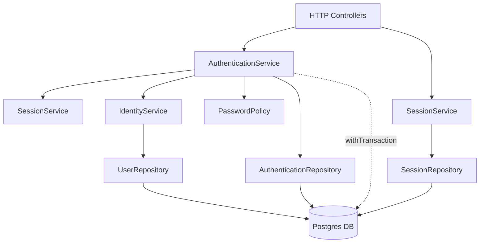

# Authentication Subsystem Handoff Guide

Welcome to the Nearby-Locator Authentication Subsystem. This document serves as an onboarding guide to help engineers understand how local authentication (email/password) operates within the platform.

---

## 1. Architecture Overview

The local authentication architecture enforces strict boundary isolation between the HTTP presentation layer and the database. 

1. **Controllers** manage HTTP status codes, secure cookies, rate limiting, and parameter extraction. 
2. **Domain Services** manage business logic, idempotency checks, token generation, and audit logging. 
3. **Repositories** execute SQL queries under the domain's transaction executor.

**Critical Rule:** Database queries (`db(...)`) and raw transactions are strictly forbidden in the Services and Controllers. Repositories must handle all SQL, and Services must use the centralized `withTransaction` executor for mutations.

## 2. Final Component Diagram



## 3. Service Responsibilities

- **`AuthenticationService`**: The primary orchestrator. Handles login, registration, token refresh, logout, password resets, and changes. It initiates all transactions and acts as the gatekeeper for user entry.
- **`SessionService`**: Manages the concept of a "Session Family" (a lineage of rotated refresh tokens). Handles idempotent revocation, active session retrieval, and session locking during rotation or logout.
- **`IdentityService`**: Ensures a user is in a valid state (not banned or suspended) before granting access. Responsible for fetching the user row under a `FOR UPDATE` lock during sensitive operations (like changing passwords).
- **`PasswordPolicy`**: A pure validation service enforcing password length, complexity, and security entropy requirements.

## 4. Repository Responsibilities

- **`AuthenticationRepository`**: Provides the foundational `withTransaction(executor)` wrapper to the Service layer. Handles specialized token consumption (e.g., `findResetTokenForUpdate`).
- **`SessionRepository`**: Executes `user_sessions` queries. Revokes specific lineages or entire families while tracking `rowsAffected` to power idempotent service responses.
- **`UserRepository`**: Executes `users` queries. Reads user data and handles legacy (OAuth) creation.

## 5. Transaction Boundaries

All state-mutating operations inside `AuthenticationService` are fully atomic. 

```javascript
// Typical AuthenticationService pattern
return await withTransaction(async (executor) => {
    // 1. Lock rows via repository (SELECT ... FOR UPDATE)
    // 2. Validate state
    // 3. Perform mutation via repository
    // 4. Append audit log via executor
});
```

* **Early Commits**: If a validation fails *inside* the lock (e.g., the user was just banned), the transaction intentionally commits only an Audit Log (e.g., `ACCOUNT_DISABLED`) and performs no mutations, rather than performing a hard rollback which would erase the log.
* **Serialization**: Identical concurrent requests are serialized by Postgres row locking, preventing torn state or duplicate tokens.

## 6. Authentication Lifecycle

1. **Signup**: Creates a `PENDING_VERIFICATION` user without generating active tokens. Returns a 201.
2. **Login**: Verifies credentials, resets rate limits, and creates an entirely new Session Family. Issues a short-lived Access Token (JWT) in the JSON body and a long-lived Refresh Token in a secure `HttpOnly` cookie.
3. **Refresh**: Validates the Refresh Token via `FOR UPDATE` lock. Generates a new Refresh Token in the same Session Family lineage, invalidates the old token, and issues a new Access Token.
4. **Logout**: Idempotently revokes the specific active Session Family.
5. **Password Reset**: Unauthenticated flow utilizing a secure URL token (`password_reset_tokens`). The token is verified under a row lock and immediately consumed (`invalidated_at`) to ensure one-time usage.
6. **Change Password**: Authenticated flow requiring the `oldPassword`. Acquires a user row lock, verifies the old hash, updates the hash, and aggressively **revokes all session families except the one performing the change**.

## 7. Database Tables Used

- `users`: Core identity table (passwords, emails, statuses).
- `user_sessions`: Tracks active/revoked refresh token lineages (Session Families).
- `password_reset_tokens`: High-entropy reset links tracked by explicit consumption dates.
- `audit_logs`: Append-only, transactionally-safe event tracking (e.g., `LOGIN_SUCCESS`, `STALE_CREDENTIALS`, `REPLAY_ATTACK_DETECTED`).
- `login_attempts`: Specialized table powering the automated account lockout sliding window.

## 8. Security Guarantees

- **Replay Mitigation**: If a previously rotated refresh token is presented again, the system recognizes a theft event, revokes the **entire session family** instantly, and logs a `REPLAY_ATTACK_DETECTED` audit event.
- **DTO Sanitation**: Raw password hashes, token hashes, and internal `session_family_id` fields are scrubbed from all Service layer responses via Data Transfer Objects. They never reach the Controller layer.
- **CSRF Protection**: Token rotation and mutation endpoints require strict `sameSite` cookie guards and custom header validation (`X-Requested-With` / `Origin`).

## 9. Deferred Work & Technical Debt

The system currently carries several known architectural inconsistencies resulting from its legacy migration:
- **`authJwt.js` Middleware**: Directly accesses the database (`db('users')`) instead of utilizing a fast read-model or Redis cache.
- **OAuth (Google)**: Operates outside the transaction boundaries utilizing raw database inserts.
- **Admin Overrides**: `adminController.js` performs direct `db('user_sessions').del()` operations, bypassing the standardized `LOGOUT` audit trail.

## 10. Future Migration Order

The architectural roadmap dictates the following phases to address remaining debt:

- **Phase 9: Middleware & Performance Optimization**: Refactor `authJwt.js` to decouple from Postgres, build a Redis caching layer for session claims, and upgrade `EmailVerificationService` to the transaction model.
- **Phase 10: OAuth Modernization**: Re-architect Google Login (`googleUpsert`) to live inside `AuthenticationService` and utilize transaction serialization.
- **Phase 11: Admin Security Controls Refactor**: Abstract admin forced actions into secure `AuthenticationService.adminForceLogoutAll` methods that maintain the audit trail.
- **Phase 12: Advanced Security Policies**: Implement historical password-hash tracking to prevent cyclic reuse, and establish foundational architecture for Multi-Factor Authentication (MFA).
